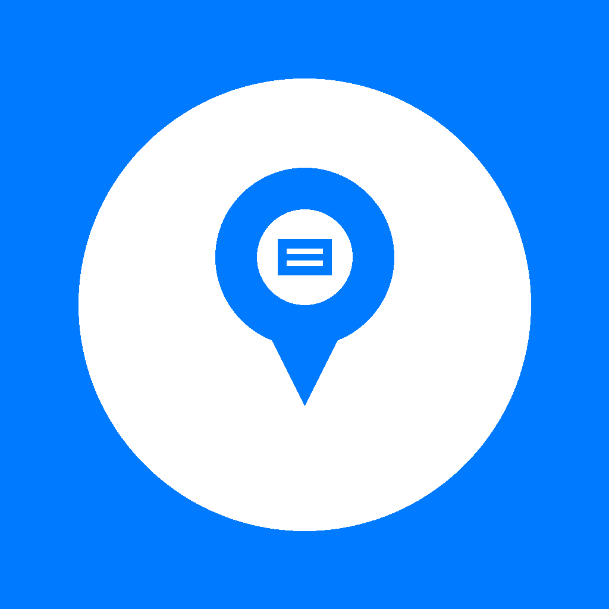

# Notary Finder NL

Find certified notaries near you in the Netherlands.

  

## About

Notary Finder NL helps users locate professional notary services across the Netherlands quickly and easily using location-based search.

## Features

- 📍 **Location-Based Search** - Find notaries near your current location
- 📞 **Direct Contact** - Call or email notaries directly from the app
- 🕐 **Business Hours** - View opening hours and availability
- 🔍 **Smart Filtering** - Filter by distance and ratings
- 💾 **Offline Mode** - Access previously viewed notaries without internet
- 🗺️ **Comprehensive Coverage** - Data from OpenStreetMap and other sources

## Screenshots

[Coming Soon]

## Requirements

- iOS 15.0 or later
- iPhone or iPad
- Location services enabled for best experience

## Privacy Policy

Your privacy is important to us. Notary Finder NL:

- Only uses location data to find nearby notaries
- Does not collect or store personal information
- Does not track user behavior
- Does not share data with third parties
- Does not require user accounts or registration

Location data is processed locally on your device and is only used to calculate distances to notaries.

## Support

If you need help or have questions:

- **Email**: [your-email@example.com]
- **Issues**: Use the [Issues](https://github.com/[your-username]/notary-finder-nl-support/issues) tab
- **Response Time**: Within 24-48 hours

### Common Issues

**Q: Why can't I see any notaries?**
A: Make sure location services are enabled for the app in Settings → Privacy → Location Services

**Q: How accurate is the data?**
A: Data is sourced from OpenStreetMap and is regularly updated. If you find incorrect information, please let us know.

**Q: Can I use the app offline?**
A: Yes, previously viewed notaries are cached for offline access.

## Version History

### Version 1.0.0 (Current)
- Initial release
- Location-based notary search
- Contact integration
- Filtering options

## Legal

This app is provided as-is for informational purposes. Always verify notary credentials and availability before visiting.

## Contact

For business inquiries or feedback:
- Email: [your-email@example.com]

---

© 2024 Notary Finder NL. All rights reserved.

Made with ❤️ in the Netherlands